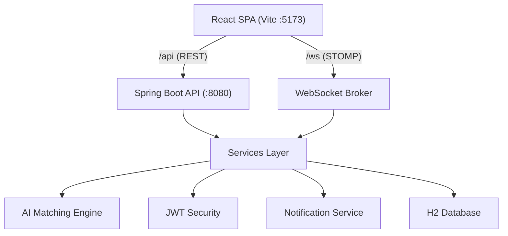

# SkillBridge — AI-Driven Skill Worker Hiring Platform

SkillBridge connects local businesses with skilled and unskilled workers in real time. Workers build rich profiles (skills, experience, location, availability, expected salary, verification). Employers post job requirements and get an AI-ranked list of compatible workers. Everything — matching, messaging, interview scheduling, ratings, notifications — happens in one place.

## Tech Stack

| Layer | Technology |
|-------|-----------|
| Backend | Spring Boot 3.2 (Java 17), Spring Data JPA, Spring Security + JWT, Spring WebSocket (STOMP) |
| Database | H2 (in-memory, auto-seeded on start) |
| Frontend | React 18 + Vite, React Router, Axios, STOMP.js + SockJS, Leaflet maps, i18next (EN / Kiswahili / हिन्दी) |
| AI Matching | Custom weighted scoring engine (skill lexicon + GPS distance + experience + availability + salary + ratings) |

## Architecture



- Vite dev server proxies `/api` and `/ws` to the backend (single exposed preview port).
- Real-time features (notifications, chat messages) push over STOMP topics:
  - `/topic/notifications/{userId}`
  - `/topic/chat/{conversationId}`
  - `/topic/conversations/{userId}`

## Features

- **Auth & Roles** — JWT-based login/register with `WORKER`, `EMPLOYER`, `ADMIN` roles.
- **Worker Profiles** — skills (tag input with synonym-aware lexicon), experience, bio, city/area, GPS pin on map, availability, expected salary + unit, verification document submission.
- **Job Posting** — title, description, required skills, work type (daily/weekly/monthly/permanent), salary + unit, location + GPS, workers needed, urgent flag, open/closed/filled lifecycle.
- **AI Matching Engine** — computes a 0–100 score per worker/job pair from weighted signals:
  - Skill compatibility (40%) via an alias-expanding skill lexicon
  - Distance (20%) via Haversine
  - Experience (10%), Availability vs work type (10%)
  - Salary expectations (15%), Ratings (5%)
  - Matches ≥ 60% are persisted and the worker receives a real-time notification.
- **Search & Filter** — jobs and workers filter by keyword, skills, city, work type, salary range, GPS distance, min rating, verification status, availability, and min experience; results sorted by match score for workers.
- **Applications** — workers apply with a cover message; employers accept/reject; accepting fills worker slots, auto-closes the job when full, and triggers an instant wallet payment from employer to worker.
- **Wallets & Payments** — every user gets a wallet. Employers fund their wallet and are debited on job acceptance; workers are credited immediately. Full transaction history (fund / withdraw / job payment) is visible to users and admin.
- **Skill Catalog** — a shared, admin-managed skill list (with categories) powers worker profiles and job requirements, so both sides pick from the same vocabulary.
- **In-app Chat** — conversation model worker↔employer (tied to a job), real-time STOMP delivery, read receipts, unread counts.
- **Interview Scheduling** — employers invite workers (in-person/video/phone, time, location, notes); workers confirm or cancel; employers mark complete.
- **Ratings & Reviews** — 1–5 stars + comment, only after a completed interview or prior interaction; live average rating aggregation on user profiles.
- **Multilingual** — English, Kiswahili, Hindi; language selector persists in `localStorage`.
- **GPS Location** — Leaflet map picker stores lat/lng on profiles and jobs; distance-aware matching and search.
- **Role-Specific Dashboards** — each role sees exactly the tools it needs:
  - **Worker:** Job Worked (accepted jobs + payment receipts), My Skills (catalog picker), Interviews, My Profile, Reviews, Wallet.
  - **Employer:** Post a Job, My Jobs (with applicants managed inline), Business Profile, Reviews, Wallet.
  - **Admin:** Posted Jobs (grouped by employer), Find Workers, Match Workers, Interviews Scheduled, Business Profiles, Reviews for Workers, Reviews of Employers, Payments/Wallet, Post a Job, Post a Skill.

## Project Layout

```
backend/   Spring Boot API (Maven)
  src/main/java/com/skillbridge/
    config/     SecurityConfig, WebSocketConfig, DataSeeder
    controller/ REST controllers
    dto/        Request/response records
    model/      JPA entities + enums
    repository/ Spring Data repositories
    security/   JWT utilities, filters, auth helpers
    service/    Business logic + AI matching engine
    websocket/  STOMP broker config
frontend/  React SPA (Vite)
  src/
    components/  Navbar, DashboardShell, Maps, InterviewModal, tabs, WalletTab
    context/     AuthContext (token + user state)
    hooks/       useStomp (realtime notifications + chat)
    pages/       Landing, Login, Register, Chat,
                 worker/  (job worked, my skills, profile, interviews)
                 employer/(post job, my jobs w/ applicants, business profile)
                 admin/   (posted jobs, find/match workers, interviews, business
                           profiles, role reviews, payments/wallet, post job/skill)
    i18n.js      EN / SW / HI translations
start.sh   Starts backend + frontend together
```

## Wallets & Payments Model

- **Funding:** employers top up their wallet (demo: seeded employers + platform start with KSh 100,000).
- **Job Payment:** when an employer accepts an application, the job salary is transferred automatically:
  - Employer wallet: debit (`JOB_PAYMENT`)
  - Worker wallet: credit (`JOB_PAYMENT`)
  - Both parties get a real-time notification.
- **Withdrawals:** workers and employers can withdraw to M-Pesa / bank (demo — no external gateway).
- **Transactions:** every fund / withdraw / job payment is recorded with type, reference, amount, description and timestamp.
- **Admin oversight:** admin sees every user wallet balance and the full payment ledger under Payments/Wallet.

## Run It

Prerequisites: Java 17+, Maven 3.8+, Node.js 18+.

```bash
./start.sh
```

Or manually:

```bash
# Backend (port 8080)
cd backend && mvn package -DskipTests
java -jar target/skillbridge-backend-1.0.0.jar

# Frontend (port 5173 - the preview port, proxies /api and /ws)
cd frontend && npm install && npm run dev
```

The database is in-memory H2 and auto-seeds demo data on startup (resets each run).

## Demo Accounts

| Role | Email | Password |
|------|-------|----------|
| Admin | admin@skillbridge.com | admin123 |
| Worker (carpenter) | john.kamau@mail.com | pass1234 |
| Worker (electrician) | david.kiprop@mail.com | pass1234 |
| Worker (cleaner) | mary.wanjiru@mail.com | pass1234 |
| Employer (construction) | james@safiriconstruction.com | pass1234 |
| Employer (restaurant) | amina@bloomrestaurants.com | pass1234 |

## Key API Endpoints

| Method | Path | Description |
|--------|------|-------------|
| POST | `/api/auth/register` / `/api/auth/login` | Auth (returns JWT) |
| GET/PUT | `/api/worker/profile`, `/api/employer/profile` | Profiles |
| GET | `/api/workers` | Search workers (filters) |
| POST | `/api/jobs/search` | Search jobs with filters + match score |
| POST | `/api/employer/jobs` | Post a job (triggers AI matching; admins can post too) |
| POST | `/api/jobs/{id}/apply` | Apply to a job |
| PATCH | `/api/employer/applications/{id}` | Accept/reject an application (accept = wallet payment) |
| GET | `/api/worker/matches` | AI-ranked job matches for the worker |
| GET/POST | `/api/wallet`, `/api/wallet/fund`, `/api/wallet/withdraw` | User wallet + transactions |
| GET | `/api/skills` | Skill catalog (public list) |
| GET/POST | `/api/chat/conversations`, `/api/chat/send` | Chat |
| POST | `/api/employer/interviews` | Schedule interview |
| POST | `/api/reviews` | Write a review |
| GET | `/api/admin/matches`, `/api/admin/interviews`, `/api/admin/employers` | Admin views |
| GET | `/api/admin/reviews/{WORKER\|EMPLOYER}` | Role-filtered reviews for admin |
| GET | `/api/admin/wallets`, `/api/admin/payments` | Admin wallet/payment ledger |
| POST | `/api/admin/skills` | Admin creates a catalog skill |
| WS | `/ws` | STOMP for realtime notifications + chat |
