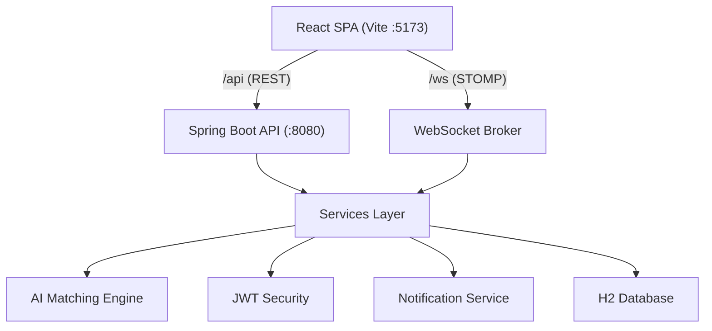

# SkillBridge — AI-Driven Skill Worker Hiring Platform

SkillBridge connects local businesses with skilled and unskilled workers in real time. Workers build rich profiles (skills, experience, location, availability, expected salary, verification). Employers post job requirements and get an AI-ranked list of compatible workers. Everything — matching, messaging, interview scheduling, ratings, notifications — happens in one place.

## Tech Stack

| Layer | Technology |
|-------|-----------|
| Backend | Spring Boot 3.2 (Java 17), Spring Data JPA, Spring Security + JWT, Spring WebSocket (STOMP) |
| Database | H2 (in-memory, auto-seeded on start) |
| Frontend | React 18 + Vite, React Router, Axios, STOMP.js, Leaflet maps, i18next (English / हिन्दी, more Indian languages planned) |
| AI Matching | Custom weighted scoring engine (skill lexicon + GPS distance + experience + availability + salary + ratings) |

## Architecture



- Vite dev server proxies `/api` and `/ws` to the backend (single exposed preview port).
- Real-time features (notifications, chat messages) push over STOMP topics:
  - `/topic/notifications/{userId}`
  - `/topic/chat/{conversationId}`
  - `/topic/conversations/{userId}`

## Features

- **Separate accounts** — workers, employers and admins live in three separate tables with their own login routes; roles are enforced by Spring Security, and a token from one side is rejected (403) on the other's routes.
- **Worker Profiles** — skills (tag input with synonym-aware lexicon), experience, bio, city/area, GPS pin on map, availability, expected salary + unit, verification document submission.
- **Job Posting** — title, description, required skills, work type (daily/weekly/monthly/permanent), salary + unit, location + GPS, workers needed, urgent flag, open/closed/filled lifecycle.
- **AI Matching Engine** — computes a 0–100 score per worker/job pair from weighted signals:
  - Skill compatibility (40%) via an alias-expanding skill lexicon
  - Distance (20%) via Haversine
  - Experience (10%), Availability vs work type (10%)
  - Salary expectations (15%), Ratings (5%)
  - Matches ≥ 60% are persisted and the worker receives a real-time notification.
- **Search & Filter** — jobs and workers filter by keyword, skills, city, work type, salary range, GPS distance, min rating, verification status, availability, and min experience; results sorted by match score for workers.
- **Applications** — workers apply with a cover message; employers accept/reject; accepting fills worker slots, auto-closes the job when full, and triggers an instant wallet payment from employer to worker.
- **Wallets & Payments** — every user gets a wallet. Employers fund their wallet and are debited on job acceptance; workers are credited immediately. Full transaction history (fund / withdraw / job payment) is visible to users and admin.
- **Skill Catalog** — a shared, admin-managed skill list (with categories) powers worker profiles and job requirements, so both sides pick from the same vocabulary.
- **In-app Chat** — conversation model worker↔employer (tied to a job), real-time STOMP delivery, read receipts, unread counts.
- **Interview Scheduling** — employers invite workers (in-person/video/phone, time, location, notes); workers confirm or cancel; employers mark complete.
- **Ratings & Reviews** — 1–5 stars + comment, only after a completed interview or prior interaction; live average rating aggregation on user profiles.
- **Multilingual** — English and Hindi today; Telugu, Kannada, Tamil, Malayalam, Marathi and Bengali are offered at signup and marked "coming soon" until translated.
- **GPS Location** — Leaflet map picker stores lat/lng on profiles and jobs; distance-aware matching and search.
- **Role-Specific Dashboards** — each role sees exactly the tools it needs:
  - **Worker:** Job Worked (accepted jobs + payment receipts), My Skills (catalog picker), Interviews, My Profile, Reviews, Wallet.
  - **Employer:** Post a Job, My Jobs (with applicants managed inline), Business Profile, Reviews, Wallet.
  - **Admin:** Posted Jobs (grouped by employer), Find Workers, Match Workers, Interviews Scheduled, Business Profiles, Reviews for Workers, Reviews of Employers, Payments/Wallet, Post a Job, Post a Skill.

## Public Website (pre-login)

Everything a visitor sees before signing in lives in `frontend/src/marketing/`, with its
own navigation, footer and design system (`marketing.css`, all classes prefixed `mk-`).
It never touches the signed-in app styles.

| Route | Page | Route | Page |
|-------|------|-------|------|
| `/` | Home | `/about` | About Us |
| `/how-it-works` | How It Works | `/careers` | Careers |
| `/for-workers` | For Workers | `/blog`, `/blog/:id` | Blog + articles |
| `/for-employers` | For Employers | `/help` | Help & Support |
| `/categories` | Job Categories | `/contact` | Contact Us |
| `/jobs` | Find Jobs (public listings) | `/legal`, `/legal/:slug` | 8 policy pages |
| `/workers` | Find Workers (public listings) | `/login`, `/register` | Auth |
| `/stories` | Success Stories | `*` | 404 |
| `/pricing` | Pricing | | |
| `/safety` | Safety & Verification | | |
| `/app` | Mobile App | | |

- **All copy lives in `marketing/content.js`** — text changes and future translations
  are a single-file job.
- `/jobs` and `/workers` read the public `GET /api/jobs` and `GET /api/workers`
  endpoints. Worker listings deliberately show a shortened name and no contact details.
- `?role=WORKER` / `?role=EMPLOYER` on `/register` preselects the signup type, so the
  "I need work" and "I want to hire" buttons land on the right form.

### Before going live

- `STATS` in `content.js` holds placeholder launch figures from the design — swap in real numbers.
- The 8 policy documents are plain-language **drafts** and render a "pending legal review" notice.
- The contact form composes a `mailto:` because there is no contact endpoint yet.
- App Store / Google Play buttons are inert placeholders.
- Marketing copy is English only; the language selector sets the app's language for after sign-in.

## Project Layout

```
backend/   Spring Boot API (Maven)
  src/main/java/com/skillbridge/
    config/     SecurityConfig, WebSocketConfig, DataSeeder
    controller/ REST controllers
    dto/        Request/response records
    model/      JPA entities + enums
    repository/ Spring Data repositories
    security/   JWT utilities, filters, auth helpers
    service/    Business logic + AI matching engine
    websocket/  STOMP broker config
frontend/  React SPA (Vite)
  src/
    components/  Navbar, DashboardShell, Maps, InterviewModal, tabs, WalletTab
    context/     AuthContext (token + user state)
    hooks/       useStomp (realtime notifications + chat)
    pages/       Landing, Login, Register, Chat,
                 worker/  (job worked, my skills, profile, interviews)
                 employer/(post job, my jobs w/ applicants, business profile)
                 admin/   (posted jobs, find/match workers, interviews, business
                           profiles, role reviews, payments/wallet, post job/skill)
    i18n.js      EN / SW / HI translations
start.sh   Starts backend + frontend together
```

## Wallets & Payments Model

- **Funding:** employers top up their wallet (demo: seeded employers start with ₹200,000).
- **Job Payment:** when a worker **accepts an offer**, the job salary is transferred exactly once:
  - Employer wallet: debit (`JOB_PAYMENT`)
  - Worker wallet: credit (`JOB_PAYMENT`)
  - Both parties get a real-time notification.
- **Withdrawals:** workers and employers can withdraw to bank / UPI (demo — no external gateway).
- **Transactions:** every fund / withdraw / job payment is recorded with type, reference, amount, description and timestamp.
- **Admin oversight:** admin sees every user wallet balance and the full payment ledger under Payments/Wallet.

## Run It

Prerequisites: Java 17+, Maven 3.8+, Node.js 18+.

```bash
./start.sh
```

Or manually:

```bash
# Backend (port 8080)
cd backend && mvn package -DskipTests
java -jar target/skillbridge-backend-1.0.0.jar

# Frontend (port 5173 - the preview port, proxies /api and /ws)
cd frontend && npm install && npm run dev
```

The database is in-memory H2 and auto-seeds demo data on startup (resets each run).

## Demo Accounts

Every account can sign in with **either its email or its mobile number** (password unchanged).

| Role | Email | Mobile | Password |
|------|-------|--------|----------|
| Admin | admin@skillbridge.com | 9000000001 | admin123 |
| Employer (construction) | james@safiriconstruction.com | 9000000002 | pass1234 |
| Employer (restaurant) | amina@bloomrestaurants.com | 9000000003 | pass1234 |
| Worker (carpenter) | john.kamau@mail.com | 9000000007 | pass1234 |
| Worker (cleaner) | mary.wanjiru@mail.com | 9000000008 | pass1234 |
| Worker (electrician) | david.kiprop@mail.com | 9000000013 | pass1234 |

Seeded mobiles run 9000000001–9000000016 in seeder order; all are pre-verified.

## Account Separation

Workers, employers and admins are **three separate account tables** in the same H2
database. There is no shared `users` table, and each side has its own auth namespace.

| Table | Login route | Frontend login |
|---|---|---|
| `worker_accounts` | `POST /api/worker/auth/login` | `/worker/login` |
| `employer_accounts` | `POST /api/employer/auth/login` | `/employer/login` |
| `admin_accounts` | `POST /api/admin/auth/login` | `/admin/login` |

- Each namespace also carries `register`, `otp/request`, `otp/verify` and `me`.
- The JWT carries the account type; a worker token is **rejected with 403** on employer
  routes and vice versa. Roles are now enforced by Spring Security
  (`/api/worker/**` → `hasRole("WORKER")`), not by ad-hoc checks in services.
- Phone numbers are unique **per table**, so the same person can hold both a worker and
  an employer account — intentional for a shop owner who also picks up shifts.
- Entities that always belong to one side use a typed FK (`JobPost` → employer,
  `JobApplication` → worker). The four that can belong to either — `Message.sender`,
  `Notification`, `Wallet`, `Review` — store a `(type, id)` pair.
- `/login` asks which kind of account you have, since the two are separate systems.

## Worker App

The worker experience lives in `frontend/src/worker/` under `/worker/*`:

| Route | Screen | Route | Screen |
|-------|--------|-------|--------|
| `/worker` | Dashboard | `/worker/saved` | Saved Jobs |
| `/worker/jobs` | Find Jobs | `/worker/applications` | My Applications |
| `/worker/jobs/filters` | Search & Filters | `/worker/applications/:id` | Application Details |
| `/worker/jobs/map` | Nearby Jobs (map) | `/worker/offers/:id` | Job Offer |
| `/worker/jobs/:id` | Job Details | `/worker/work` · `/worker/earnings` | My Work · Earnings |
| `/worker/employers/:id` | Employer Profile | `/worker/interviews` · `/worker/messages` · `/worker/reviews` · `/worker/profile` · `/worker/settings` | rest of the sidebar |

- Job filters live in the URL, so a filtered list is shareable and survives the back button.
- Applications move through `APPLIED → VIEWED → SHORTLISTED → INTERVIEW_SCHEDULED →
  OFFERED → ACCEPTED`, with `REJECTED` / `WITHDRAWN` as exits. Transitions are validated
  server-side, which also fixes the old bug where re-accepting paid a worker twice.
- Wallet payment fires once, on offer acceptance.

## Signup & Worker Onboarding

The mobile-first signup flow lives in `frontend/src/onboarding/` and runs at `/join`:

| Route | Screen | Route | Screen |
|-------|--------|-------|--------|
| `/join` | Choose your language | `/join/about-you` | Basic information |
| `/join/account-type` | Worker or business owner | `/join/preferences` | Job preferences |
| `/join/create` | Create your account | `/join/skills` | Skills selection |
| `/join/verify` | OTP verification | `/join/location` | Location & availability |

- **Identity is the mobile number.** Email is optional. Each namespace's
  `POST /api/{type}/auth/login` takes `{identifier, password}`, where identifier is a
  phone or an email.
- `/register` (and any old `?role=` link) redirects into `/join`.
- The four profile steps each `PATCH /api/worker/onboarding`, which **merges** — only the
  fields you send change. The older `PUT /api/worker/profile` still replaces, unchanged.
- Progress is kept in `localStorage` under `sb_onboarding` so a refresh does not lose it.
  The password is never written to storage.
- All copy and choices (languages, categories, skills, radius) are in `onboarding/data.js`.

### ⚠️ Before going live: turn off the OTP dev flag

`application.yml` ships with:

```yaml
skillbridge:
  otp:
    expose-code: true   # DEV ONLY — returns the OTP in the API response
```

This exists so the flow is testable without an SMS provider, and the signup screen shows
the code in a "Demo mode" banner. **Set it to `false` in production.** Wire a real sender by
implementing `OtpSender` (the default `LoggingOtpSender` just logs the code) against MSG91,
Twilio or similar. Languages other than English and Hindi are marked "Coming soon" on the
language screen until `i18n.js` carries their strings.

## Key API Endpoints

| Method | Path | Description |
|--------|------|-------------|
| POST | `/api/{worker\|employer\|admin}/auth/login` | Auth per account type (returns JWT) |
| POST | `/api/{worker\|employer}/auth/register` · `/otp/request` · `/otp/verify` | Signup + mobile verification |
| GET/PUT | `/api/worker/profile`, `/api/employer/profile` | Profiles |
| GET | `/api/workers` | Search workers (filters) |
| POST | `/api/jobs/search` | Search jobs with filters + match score |
| POST | `/api/employer/jobs` | Post a job (triggers AI matching; admins can post too) |
| POST | `/api/jobs/{id}/apply` | Apply to a job |
| PATCH | `/api/employer/applications/{id}` | Accept/reject an application (accept = wallet payment) |
| GET | `/api/worker/matches` | AI-ranked job matches for the worker |
| GET/POST | `/api/wallet`, `/api/wallet/fund`, `/api/wallet/withdraw` | User wallet + transactions |
| GET | `/api/skills` | Skill catalog (public list) |
| GET/POST | `/api/chat/conversations`, `/api/chat/send` | Chat |
| POST | `/api/employer/interviews` | Schedule interview |
| POST | `/api/reviews` | Write a review |
| GET | `/api/admin/accounts?type=` | Accounts across the three tables |
| GET | `/api/admin/matches`, `/api/admin/interviews`, `/api/admin/employers` | Admin views |
| GET | `/api/admin/reviews/{WORKER\|EMPLOYER}` | Role-filtered reviews for admin |
| GET | `/api/reviews/target/{accountType}/{id}` | Reviews about an account |
| GET/POST | `/api/worker/dashboard`, `/api/worker/jobs/search` | Worker home + job search |
| GET/POST/DELETE | `/api/worker/saved-jobs[/{jobId}]` | Bookmarks |
| GET/POST | `/api/worker/applications[/{id}[/withdraw]]` | Applications + timeline |
| GET/POST | `/api/worker/offers[/{id}/accept\|decline]` | Job offers |
| GET | `/api/admin/wallets`, `/api/admin/payments` | Admin wallet/payment ledger |
| POST | `/api/admin/skills` | Admin creates a catalog skill |
| WS | `/ws` | STOMP; topics are `/topic/notifications/{TYPE}/{id}` and `/topic/conversations/{TYPE}/{id}` |
